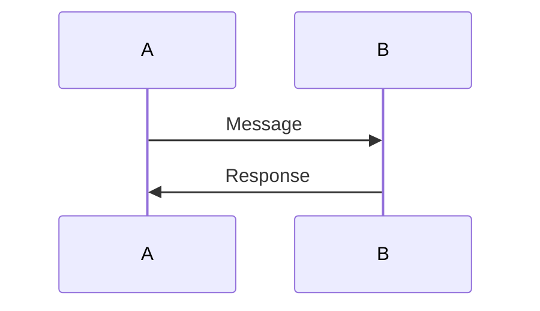
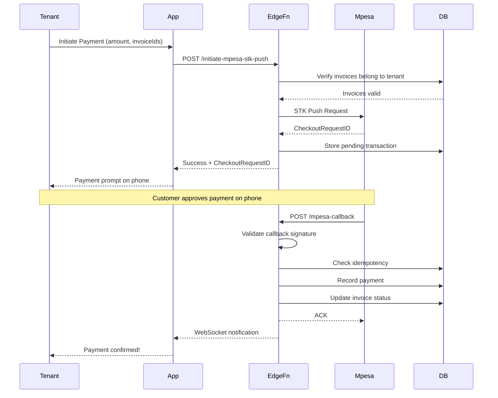

# Sequence Diagrams

This directory contains Mermaid sequence diagrams for key workflows in CALQULUS RMS.

## Overview

Sequence diagrams visualize the flow of messages between system components. They help:
- Understand complex workflows
- Document system behavior
- Identify integration points
- Debug issues

## Available Diagrams

### Authentication Flows

| Diagram | Description |
|---------|-------------|
| [Login Flow](./auth/login-flow.mmd) | User login with email/password |
| [MFA Setup](./auth/mfa-setup.mmd) | Two-factor authentication setup |
| [Password Reset](./auth/password-reset.mmd) | Password reset flow |

### Payment Flows

| Diagram | Description |
|---------|-------------|
| [M-Pesa STK Push](./payments/mpesa-stk-push.mmd) | M-Pesa payment initiation |
| [Payment Callback](./payments/payment-callback.mmd) | Payment confirmation callback |
| [Payment Reconciliation](./payments/reconciliation.mmd) | Daily payment reconciliation |

### Tenant Lifecycle

| Diagram | Description |
|---------|-------------|
| [Tenant Invitation](./tenants/invitation-flow.mmd) | Inviting a new tenant |
| [Tenant Signup](./tenants/signup-flow.mmd) | Tenant self-registration |
| [Lease Creation](./tenants/lease-creation.mmd) | Creating a new lease |

### Property Management

| Diagram | Description |
|---------|-------------|
| [Property Setup](./properties/setup-flow.mmd) | Adding a new property |
| [Unit Assignment](./properties/unit-assignment.mmd) | Assigning units to tenants |

## Viewing Diagrams

### In VS Code
Install the [Mermaid Preview](https://marketplace.visualstudio.com/items?itemName=vstirbu.vsmermaid) extension.

### Online
Copy the diagram content and paste into [Mermaid Live Editor](https://mermaid.live).

### In Markdown
```markdown

```

## Example: M-Pesa Payment Flow



## Contributing Diagrams

When adding new features:

1. Create diagram in appropriate subdirectory
2. Use `.mmd` extension (Mermaid Markdown)
3. Follow naming convention: `feature-action.mmd`
4. Update this index
5. Add to architecture documentation
